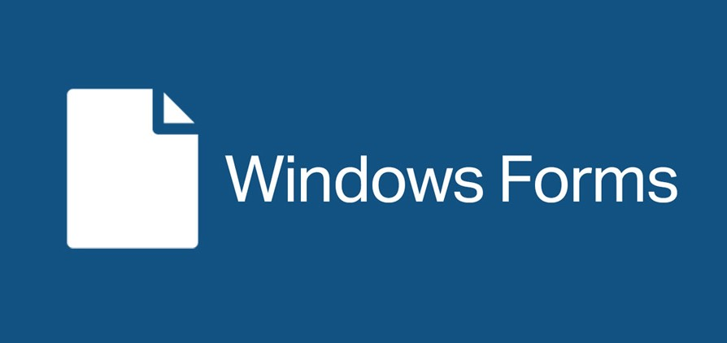
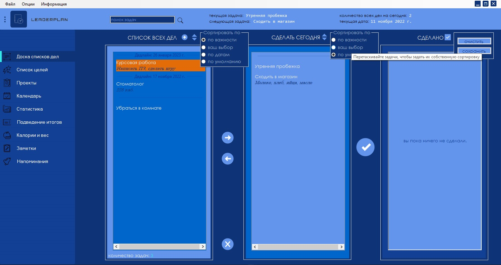
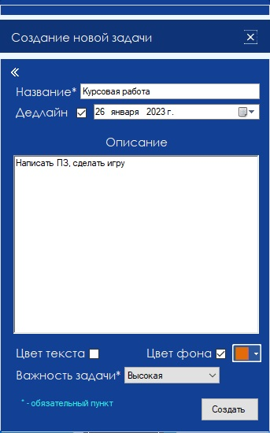

<h1 align="center"> Leaderplan </h1>

One of my first projects. <b>!OLD! - 2019</b>

 

⠀

#

 

 

 

My first serious and creative coursework in 2019 – desktop app for <b>tasks planning</b> and daily <b>work organization</b>.

 

### **«Leaderplan»** - lightweight and succinct **task scheduler** to avoid routine and raise productivity. This software product is intended for the distinct task structuring for the user first. **LP** lay it all out clearly by giving vivid picture of tasks. It has gathered in itself the features of many necessary tools for proper and structured **control of life** and it's responsibilities. 

 

 

## Relevance

Description.

 

## Issues
Description.

 

## Resolving
Description.

 

### Adding new task

